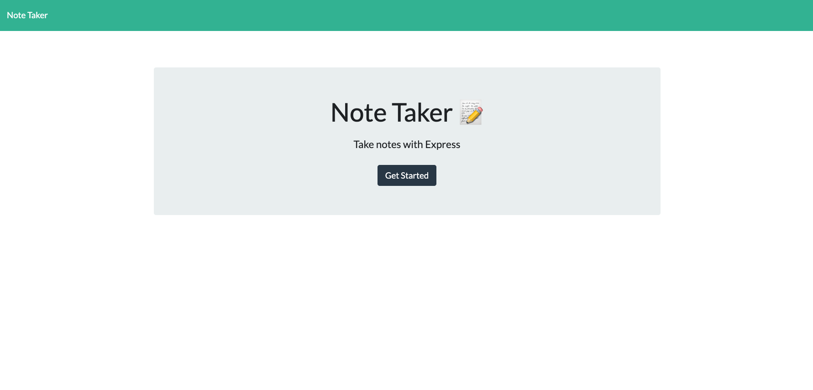

# Note Taker README

## How To Use 
* When the page opens, select 'Get Started' where you will be taken to the note taking home page
* You are immediately prompted with a blank note page
    - Add a note title
    - Fill out the note body with the desired notes
* When done with the note, select the save icon in the top right
* Your note will be saved and you added to the column on the left side of the page
* To view a previous note, select the note from the left-hand column
* The note will open and you can edit the note
* Select the save icon again to resave the note

## URL: https://gentle-reef-45514.herokuapp.com/

### User Story
AS A small business owner
I WANT to be able to write and save notes
SO THAT I can organize my thoughts and keep track of tasks I need to complete

### Acceptance Criteria
GIVEN a note-taking application
WHEN I open the Note Taker
THEN I am presented with a landing page with a link to a notes page
WHEN I click on the link to the notes page
THEN I am presented with a page with existing notes listed in the left-hand column, plus empty fields to enter a new note title and the note’s text in the right-hand column
WHEN I enter a new note title and the note’s text
THEN a Save icon appears in the navigation at the top of the page
WHEN I click on the Save icon
THEN the new note I have entered is saved and appears in the left-hand column with the other existing notes
WHEN I click on an existing note in the list in the left-hand column
THEN that note appears in the right-hand column
WHEN I click on the Write icon in the navigation at the top of the page
THEN I am presented with empty fields to enter a new note title and the note’s text in the right-hand column
